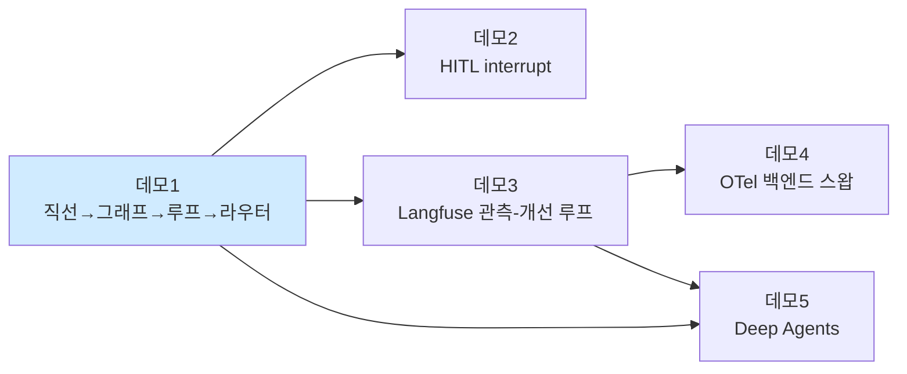

# loop-engineering-demo

**워크플로 → 루프 엔지니어링** 2시간 멘토링 세션용 라이브 데모 모노레포.
모든 데모는 **Jupyter 노트북**으로, 셀을 하나씩 실행하며 "기술 적용 전후의 차이"를
눈앞에서 보여주도록 설계됐다. 청중: 중급 Python 개발자(소프트웨어 마에스트로 연수생).



## 세션 타임라인 (120분)

| 시간 | 세그먼트 | 자료 | 핵심 메시지 |
|---|---|---|---|
| 00:00–00:10 | 개념: 워크플로 vs 루프 | 슬라이드/코퍼스 `01_loop_engineering.md` | 루프 = 자기 수정 + 탈출 조건 |
| 00:10–00:40 | **데모 1** Workflow → Loop | `demo1_workflow_to_loop/demo1.ipynb` | 같은 질문, 단계마다 좋아지는 답 |
| 00:40–00:55 | **데모 2** Human-in-the-Loop | `demo2_hitl/demo2.ipynb` | 위험한 행동 앞에서 멈추기 |
| 00:55–01:20 | **데모 3** 관측-개선 루프 | `demo3_langfuse_loop/demo3.ipynb` | 개선은 감이 아니라 점수로 |
| 01:20–01:30 | **데모 4** OTel 스왑 | `demo4_otel_swap/demo4.ipynb` | 계측은 한 번, 백엔드는 자유 |
| 01:30–01:45 | **데모 5** Deep Agents | `demo5_deepagents/demo5.ipynb` | 그래프가 부하 직원이 된다 |
| 01:45–01:55 | 마무리: self-host/사내망 | `selfhost/README.md` | 전부 로컬 자급자족으로 돌았다 |
| 01:55–02:00 | 버퍼/Q&A | — | — |

## 빠른 시작

```bash
# 0) 요구사항: Python 3.11+, uv, Docker (데모 3~5의 관측용)
make setup                 # uv sync (최초 실행 시 uv.lock 생성/고정)
cp .env.example .env       # 기본값 = mock 모드 + selfhost 부트스트랩 키 (수정 불필요)
make up                    # Langfuse(:3000) + Phoenix(:6006) — 첫 회는 이미지 받느라 수 분
make verify                # mock 모드 전 데모 스모크 테스트
make lab                   # JupyterLab — 여기서 라이브 데모 진행
```

- `LLM_PROVIDER=mock`(기본): **API 키·네트워크 없이** 전 데모가 결정적으로 완주된다.
  실 모델은 `.env` 에서 `openai`(+키) 또는 `ollama` 로 전환 — 코드는 동일.
- 노트북 도식(mermaid)은 JupyterLab 4.1+ 에서 렌더링된다 (`make lab` 이면 충족).
  런타임 그래프 그림은 각 노트북의 `show_graph()` 셀이 `outputs/graph_*.png` 로도 저장.

## 리허설 체크리스트 (D-1)

- [ ] `make setup` — 의존성 설치 (uv.lock 커밋돼 있지 않으면 이때 생성해 커밋)
- [ ] `make up` → http://localhost:3000 로그인 확인 (`demo@example.com` / `Demo1234!`)
- [ ] `cp .env.example .env`
- [ ] `make verify` — 전 데모 mock 스모크 (Langfuse 떠 있으면 데모 3 포함)
- [ ] `make seed`(=demo3 headless) 후 대시보드에서 트레이스 10건·데이터셋 5건·run 2개 확인
- [ ] `make demo4-both` 후 Langfuse/Phoenix 양쪽에 트레이스 확인
- [ ] 발표 화면에서 `make lab` 폰트 크기·다크모드 점검

## 레포 구조

```
├── common/                  # get_llm()/get_embeddings() 프로바이더 스위칭, retriever,
│                            #   rich 콘솔 헬퍼, 시각화(3단 폴백), Langfuse/OTel 초기화
├── data/corpus/             # RAG 코퍼스 8문서 (LangGraph·Langfuse·에이전트 설계 용어집)
├── demo1_workflow_to_loop/  # demo1.ipynb (s1→s4) + adaptive_rag.py (재사용 모듈)
├── demo2_hitl/              # demo2.ipynb — interrupt/Command 승인·수정·거부
├── demo3_langfuse_loop/     # demo3.ipynb — 트레이싱→시딩→데이터셋→프롬프트→실험
├── demo4_otel_swap/         # demo4.ipynb — OpenInference + OTLP, env 로 백엔드 스왑
├── demo5_deepagents/        # demo5.ipynb — create_deep_agent + 그래프 서브에이전트
├── selfhost/                # Langfuse v3 + Phoenix compose, 사내망 체크리스트
├── scripts/verify_all.sh    # mock 전 데모 스모크
└── outputs/                 # 실행 산출물 (그래프 PNG, 발행 답변, 브리프 — gitignore)
```

## 트러블슈팅

| 증상 | 원인/해결 |
|---|---|
| `make up` 후 3000 접속 불가 | 첫 기동 마이그레이션에 1~2분 소요. `docker compose -f selfhost/docker-compose.yml logs -f langfuse-web` 로 대기 |
| 포트 충돌 (3000/6006/5432/6379/8123/9090/9091) | 점유 프로세스 종료 또는 compose 의 ports 왼쪽 값 변경 |
| 데모 3 첫 셀에서 중단 | 의도된 fail-fast — 메시지대로 `make up` / `.env` 확인 |
| OpenAI 키 없음 | `.env` 의 `LLM_PROVIDER=mock` 으로 전 데모 진행 가능 (기본값) |
| Tavily 키 없음 | `web_search` 가 경고를 출력하고 **모의 결과로 자동 폴백** (전 데모 동작) |
| 그래프 PNG 셀이 ASCII 로 나옴 | 오프라인이라 mermaid.ink 실패 → networkx 렌더러가 PNG 저장, 둘 다 실패 시 ASCII. 데모엔 지장 없음 |
| mermaid 블록이 코드로 보임 | JupyterLab < 4.1 또는 VS Code(확장 필요). `make lab` 의 JupyterLab 사용 권장 |
| deepagents 설치 실패 | Python 3.11+ 필요 (`uv python install 3.12` 후 `make setup`) |
| Langfuse OTLP 4xx | gRPC exporter 사용 금지(HTTP 전용), Langfuse ≥ v3.22 필요 |

## 자주 쓰는 명령

```bash
make help            # 전체 타깃 설명
make demo1 ... demo5 # 각 노트북 headless 실행 (리허설용, 결과: outputs/executed/)
make demo4-both      # OTel fan-out 하이라이트
make graphs          # 그래프 PNG 재생성
make down            # 로컬 스택 종료
```

## 참고

- 의존성은 `pyproject.toml` 에 상한 고정(major-bound), `uv.lock` 으로 재현성 확보.
- 모든 문서/주석은 한국어. 코퍼스는 자체 작성(외부 크롤링 없음 — 오프라인 원칙).
- 각 데모 폴더의 `README.md` 에 발표 포인트·예상 소요·예상 질문이 정리돼 있다.
